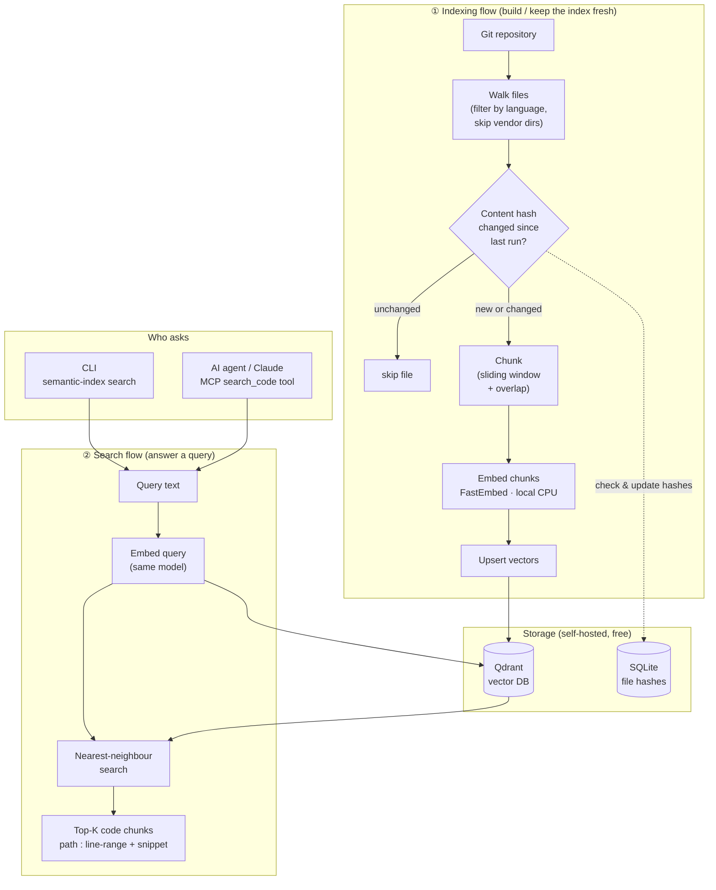

# semantic-code-search

A self-hosted **semantic code search + RAG index** with an **MCP server**, built to run end-to-end on a laptop at **zero cost** — no cloud account, no API keys, no paid services.

Point it at any Git repository and it will parse and chunk the source, embed each chunk with a local model, and store the vectors in a local Qdrant instance. Then search the codebase by meaning ("where is retry/backoff handled?") from the CLI or from an AI assistant over the Model Context Protocol.

```
$ semantic-index index ./my-project
{ "indexed": 214, "skipped": 0, "removed": 0 }

$ semantic-index search "where do we validate the incremental index state?"
[0.612] src/semantic_index/state.py:34-46 (python)
    def needs_reindex(self, path: str, sha: str) -> bool:
        row = self.conn.execute("SELECT content_sha FROM files WHERE path = ?", (path,)).fetchone()
        return row is None or row[0] != sha
----------------------------------------------------------------------
```

## Architecture

Two flows share one vector store: an **indexing** flow that keeps the index in sync with the code, and a **search** flow that answers queries. Both embed text with the *same* local model, so queries and code live in the same vector space.



**In words:** walk the repo → skip any file whose content hash is unchanged (SQLite) → chunk the rest → embed each chunk locally with FastEmbed → upsert into Qdrant. Deleted files are pruned. A query is embedded with the *same* model and answered by nearest-neighbour search in Qdrant. The CLI and an MCP `search_code` tool (for Claude and other agents) both use that one search path, so results are grounded in your actual code.

## Why these components (and how they map to a production stack)

This project deliberately mirrors the shape of a production RAG platform, but every managed/paid component is swapped for a free, local equivalent. Same architecture, $0 to run.

| Concern | Typical production choice (paid) | Here (free / local) |
|---|---|---|
| Embeddings | AWS Bedrock (Titan) / OpenAI | **FastEmbed** — quantized ONNX model, runs on CPU, no key |
| Vector store | Managed Qdrant Cloud / Pinecone | **Qdrant**, self-hosted via Docker (open-source) |
| Index state | DynamoDB | **SQLite** |
| Container registry | AWS ECR | **GitHub Container Registry (ghcr.io)** |
| Orchestration | EKS / ArgoCD | **Docker Compose** |
| CI/CD | GitHub Actions | **GitHub Actions** (unchanged) |
| Retrieval interface | Internal service | **MCP server** (stdio) |

Swapping the embedding backend or vector store is a config change (`EMBED_MODEL`, `QDRANT_URL`) — the pipeline code doesn't change.

## Quickstart

### Option A — Docker Compose (nothing to install)

```bash
docker compose up --build indexer   # starts Qdrant, indexes this repo into it
```

### Option B — Local Python

```bash
python -m venv .venv && source .venv/bin/activate
pip install -e ".[dev]"

# start a local Qdrant
docker run -p 6333:6333 qdrant/qdrant

semantic-index index .
semantic-index search "how is the vector collection created?"
```

The first run downloads the embedding model (~100–300 MB) once; subsequent runs are offline.

## Use it from Claude (MCP)

Run the MCP server (`semantic-index-mcp`) and register it with any MCP client. Example `claude` CLI config:

```json
{
  "mcpServers": {
    "semantic-code-search": {
      "command": "semantic-index-mcp"
    }
  }
}
```

The agent then has a `search_code(query, limit, language)` tool returning the top matching chunks with file paths and line ranges — grounded context for code Q&A and issue triage.

## Configuration

All settings have working defaults and are overridable via environment variables (see [`.env.example`](.env.example)): `QDRANT_URL`, `COLLECTION`, `EMBED_MODEL`, `STATE_DB`, `MAX_CHUNK_LINES`, `CHUNK_OVERLAP_LINES`, `BATCH_SIZE`.

Swap the embedding model with `EMBED_MODEL`, e.g. `BAAI/bge-small-en-v1.5` (smaller/faster) or `nomic-ai/nomic-embed-text-v1.5`. The vector dimension is detected automatically.

## Tests

```bash
pytest -q
```

Chunking and incremental-state logic are covered without needing a running Qdrant.

## License

MIT — see [LICENSE](LICENSE).
