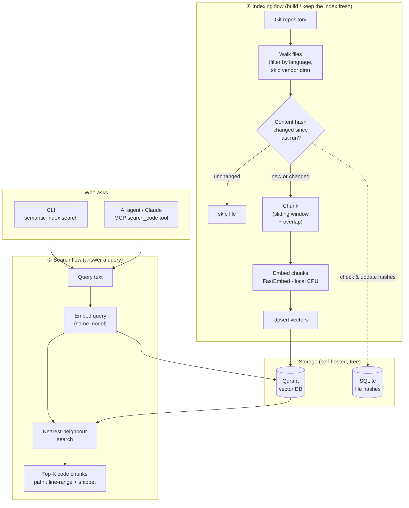

# semantic-code-search

A self-hosted **semantic code search + RAG index** with an **MCP server**, built to run end-to-end on a laptop at **zero cost** — no cloud account, no API keys, no paid services.

Point it at any Git repository and it will parse and chunk the source, embed each chunk with a local model, and store the vectors in a local Qdrant instance. Then search the codebase by meaning ("where is retry/backoff handled?") from the CLI or from an AI assistant over the Model Context Protocol.

```
$ semantic-index index ./my-project
{ "indexed": 214, "skipped": 0, "removed": 0 }

$ semantic-index search "where do we validate the incremental index state?"
[0.612] src/semantic_index/state.py:34-46 (python)
    def needs_reindex(self, path: str, sha: str) -> bool:
        row = self.conn.execute("SELECT content_sha FROM files WHERE path = ?", (path,)).fetchone()
        return row is None or row[0] != sha
----------------------------------------------------------------------
```

> 📖 **New here?** See **[USAGE.md](USAGE.md)** for a full step-by-step guide (setup, indexing, search, RAG chat, evaluation, and a 60-second smoke test).
>
> 🗺️ **Where it's headed:** see the **[Roadmap](docs/ROADMAP.md)** — AST chunking, hybrid retrieval, reranking, and a measured ablation.

## Architecture

Two flows share one vector store: an **indexing** flow that keeps the index in sync with the code, and a **search** flow that answers queries. Both embed text with the *same* local model, so queries and code live in the same vector space.


```mermaid
flowchart TB
    subgraph INDEX ["① Indexing flow  (build / keep the index fresh)"]
        direction TB
        R["Git repository"] --> W["Walk files<br/>(filter by language,<br/>skip vendor dirs)"]
        W --> CH{"Content hash<br/>changed since<br/>last run?"}
        CH -->|"unchanged"| SKIP["skip file"]
        CH -->|"new or changed"| CK["Chunk<br/>(sliding window<br/>+ overlap)"]
        CK --> EM["Embed chunks<br/>FastEmbed · local CPU"]
        EM --> UP["Upsert vectors"]
    end

    subgraph DATA ["Storage (self-hosted, free)"]
        direction LR
        QD[("Qdrant<br/>vector DB")]
        SQ[("SQLite<br/>file hashes")]
    end

    subgraph SEARCH ["② Search flow  (answer a query)"]
        direction TB
        Qin["Query text"] --> QE["Embed query<br/>(same model)"]
        QE --> KNN["Nearest-neighbour<br/>search"]
        KNN --> OUT["Top-K code chunks<br/>path : line-range + snippet"]
    end

    subgraph USERS ["Who asks"]
        direction LR
        CLI["CLI<br/>semantic-index search"]
        AGENT["AI agent / Claude<br/>MCP search_code tool"]
    end

    UP --> QD
    CH -. "check & update hashes" .-> SQ
    CLI --> Qin
    AGENT --> Qin
    QE --> QD
    QD --> KNN
```

**In words:** walk the repo → skip any file whose content hash is unchanged (SQLite) → chunk the rest → embed each chunk locally with FastEmbed → upsert into Qdrant. Deleted files are pruned. A query is embedded with the *same* model and answered by nearest-neighbour search in Qdrant. The CLI and an MCP `search_code` tool (for Claude and other agents) both use that one search path, so results are grounded in your actual code.

## Why these components (and how they map to a production stack)

This project deliberately mirrors the shape of a production RAG platform, but every managed/paid component is swapped for a free, local equivalent. Same architecture, $0 to run.

| Concern | Typical production choice (paid) | Here (free / local) |
|---|---|---|
| Embeddings | AWS Bedrock (Titan) / OpenAI | **FastEmbed** — quantized ONNX model, runs on CPU, no key |
| Vector store | Managed Qdrant Cloud / Pinecone | **Qdrant**, self-hosted via Docker (open-source) |
| Index state | DynamoDB | **SQLite** |
| Container registry | AWS ECR | **GitHub Container Registry (ghcr.io)** |
| Orchestration | EKS / ArgoCD | **Docker Compose** |
| CI/CD | GitHub Actions | **GitHub Actions** (unchanged) |
| Retrieval interface | Internal service | **MCP server** (stdio) |

Swapping the embedding backend or vector store is a config change (`EMBED_MODEL`, `QDRANT_URL`) — the pipeline code doesn't change.

## Quickstart

### Option A — Docker Compose (nothing to install)

```bash
docker compose up --build indexer   # starts Qdrant, indexes this repo into it
```

### Option B — Local Python

```bash
python -m venv .venv && source .venv/bin/activate
pip install -e ".[dev]"

# start a local Qdrant
docker run -p 6333:6333 qdrant/qdrant

semantic-index index .
semantic-index search "how is the vector collection created?"
```

The first run downloads the embedding model (~100–300 MB) once; subsequent runs are offline.

## Use it from Claude (MCP)

Run the MCP server (`semantic-index-mcp`) and register it with any MCP client. Example `claude` CLI config:

```json
{
  "mcpServers": {
    "semantic-code-search": {
      "command": "semantic-index-mcp"
    }
  }
}
```

The agent then has two tools: `search_code(query, limit, language)` returns the top matching chunks with file paths and line ranges, and `answer_question(question, k)` returns a RAG answer grounded in those chunks — both give grounded context for code Q&A and issue triage.

## Ask questions about your code (RAG chat)

On top of raw search, a retrieval-augmented chat answers natural-language questions using a **local LLM** ([Ollama](https://ollama.com)) grounded in retrieved code — no API keys, fully offline.

```bash
ollama pull qwen2.5-coder:7b          # one-time; any Ollama model works (set CHAT_MODEL)
semantic-index chat "how does incremental re-indexing decide what to skip?"
```

It retrieves the top-K chunks, feeds them to the model as cited context, and prints an answer plus its **source files (`path:line-range`)** so every claim is traceable. If no Ollama server is running, `chat` degrades gracefully to showing the retrieved context instead of failing.

## Evaluation

A retrieval system is only as good as you can measure. The `eval/` harness scores retrieval quality against a small labeled dataset ([`eval/dataset.jsonl`](eval/dataset.jsonl)) — natural-language queries mapped to the files that should be retrieved:

```bash
python -m eval.retrieval_eval     # needs a running index (Qdrant + model)
```

It reports the standard IR metrics per query and as dataset means:

| Metric | Meaning |
|---|---|
| **precision@k** | fraction of top-k results that are relevant |
| **recall@k** | fraction of relevant files found in top-k |
| **hit@k** | did any relevant file make the top-k? |
| **MRR** | 1 / rank of the first relevant hit |
| **nDCG@k** | rank-weighted relevance (higher = relevant hits ranked earlier) |

For **answer quality**, `eval/judge.py` provides RAGAS-style **faithfulness** and **context-relevance** scores via an LLM-as-judge (the same local Ollama model) — so you can catch answers that drift from the retrieved context, not just measure retrieval. The interface (`context, question, answer -> score`) matches the [`ragas`](https://docs.ragas.io) library if you want to swap in its full suite.

The metric functions in `eval/metrics.py` are pure and unit-tested (`tests/test_eval_metrics.py`) — they run with no network or Qdrant.

### A measured ablation (Gitea)

To *validate* rather than assume each retrieval change, [`eval/ablation.py`](eval/ablation.py) runs the pipeline across configurations against a real, recognizable corpus — [go-gitea/gitea](https://github.com/go-gitea/gitea) (~24k AST chunks) — using [`eval/dataset_gitea.jsonl`](eval/dataset_gitea.jsonl) (28 feature-level queries + 11 negatives). Each row adds one change on top of the previous.

```bash
python -m eval.ablation /path/to/gitea --dataset eval/dataset_gitea.jsonl
```

**Round 1 — the assumption-driven stack** (bge-small, max-pool, k = 5):

| Config | recall@5 | MRR | nDCG@5 |
|---|---|---|---|
| baseline (line chunks, dense) | **0.464** | **0.385** | **0.373** |
| + AST chunking | 0.268 | 0.179 | 0.173 |
| + hybrid (dense + BM25) | 0.393 | 0.248 | 0.262 |
| + reranking | 0.411 | 0.294 | 0.288 |

The harness surfaced a real, non-obvious result: **AST chunking *regressed* feature-level recall** — per-function chunks strip the surrounding context that natural-language queries ("where is login handled?") rely on — and the stacked upgrades never beat the plain baseline.

**Round 2 — measurement-driven fixes.** Diagnosing that regression produced the changes that
actually moved the needle: **path-context embedding** (`EMBED_CONTEXT=path` — prepend the file
path to the *embedded* text, so a chunk from `services/auth/oauth2.go` carries its feature
vocabulary), per-file **sum-of-top-N pooling** ([`eval/aggregate.py`](eval/aggregate.py)), fair
non-stacked arms, and a model comparison. The model × context matrix (line chunks, dense, k = 5):

| recall@5 / MRR / nDCG@5 | bge-small (0.067 GB) | jina-code (0.64 GB) |
|---|---|---|
| no context | 0.464 / 0.385 / 0.373 | 0.571 / 0.441 / 0.447 |
| **+ path context** | **0.804 / 0.588 / 0.629** | 0.679 / 0.480 / 0.506 |

Findings, in order of surprise:
- **Path-context embedding is the dominant fix**: +73% relative recall on line chunks, and it
  *cures* the AST regression (0.268 → 0.786 recall with sum-3 pooling). It is now the default.
- **The code-specialized model lost to the small general model** once context was on — despite
  helping on the raw baseline. Domain-specialized ≠ better for your task; **the default embedder
  is now `bge-small` based on this data** (also ~10× smaller and ~5× faster to index).
- **Reranking with a general-purpose cross-encoder is actively harmful** on code (≈0.48 recall
  ceiling at both 40 and 100 candidates) — measured and rejected; `RERANK` stays off by default.
- Sum-of-top-3 pooling reliably helps dense retrieval; hybrid helps un-contextualized arms but
  dilutes contextualized ones.
- Operational: long-context embedding models need bounded inputs — `EMBED_MAX_CHARS` exists
  because one long-line generated file could spike ~17 GB of attention memory (see
  [`eval/RESULTS.md`](eval/RESULTS.md) for both OOM mechanisms).

Full per-configuration grids: [`eval/RESULTS.md`](eval/RESULTS.md).

Honest caveats: 28 labeled queries (each ≈3.6 points of recall — treat sub-0.05 deltas as noise),
one corpus, one run. The headline gaps (context +0.34 recall, model −0.13) are well beyond noise.

## Configuration

All settings have working defaults and are overridable via environment variables (see [`.env.example`](.env.example)): `QDRANT_URL`, `COLLECTION`, `EMBED_MODEL`, `STATE_DB`, `MAX_CHUNK_LINES`, `CHUNK_OVERLAP_LINES`, `BATCH_SIZE`, `OLLAMA_URL`, `CHAT_MODEL`.

Swap the embedding model with `EMBED_MODEL`, e.g. `BAAI/bge-small-en-v1.5` (smaller/faster) or `nomic-ai/nomic-embed-text-v1.5`. The vector dimension is detected automatically.

## Tests

```bash
pytest -q
```

Chunking and incremental-state logic are covered without needing a running Qdrant.

## License

MIT — see [LICENSE](LICENSE).
